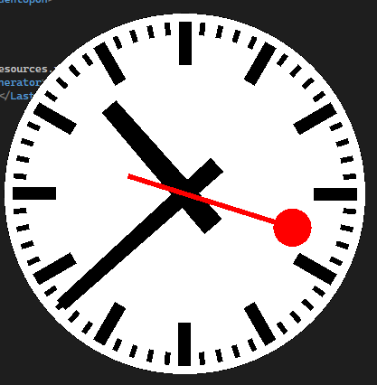

# CFF Clock
## Description
This is a simple clock that displays the current time with the CFF looks. It is written in C#. The clock is displayed withouth any window border and is always on top of other windows. The clock is resizable and can be moved around the screen. The clock can be closed with the ESC key.

